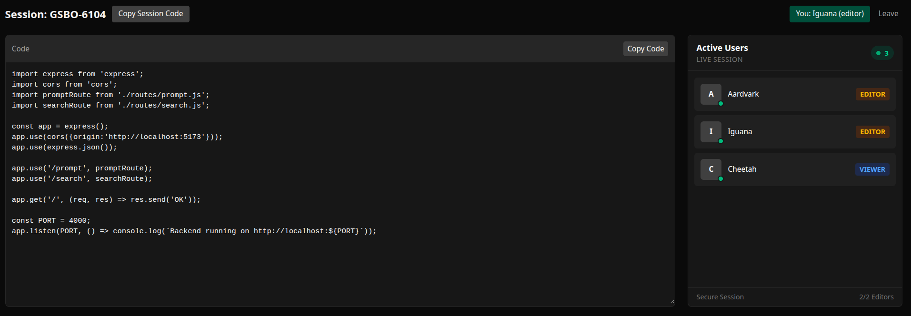

# Slate🎴
A lightweight real-time pair programming application.
It allows two users to collaboratively edit code in real time, while additional users can join as `read-only` viewers.

No authentication. No accounts. Just share a session code and start coding.




### Features
- No authentication required; join instantly using a session code
- Real-time code collaboration powered by `WebSockets`
- Maximum of two **editors** per session
- Additional users join as `read-only` **viewers**
- Oldest connected `viewer` is promoted when an `editor` leaves
- Live **user list** with real-time **join** and **leave** pop ups.


### Folder Structure
```
├── client/
│   ├── app/
│   │   ├── page.tsx              # Landing / join session page
│   │   └── live/
│   │       └── [code]/
│   │           └── page.tsx      # Live session page
│   ├── components/
│   │   ├── CodeEditor.tsx        # Editor (read/write or read-only)
│   │   ├── UserList.tsx          # Live user list
│   │   └── Notification.tsx      # Join/leave alerts
│   ├── lib/
│   │   ├── utils.ts              # Function to generate session code
│   │   └── types.ts              # Shared TypeScript types
│   └── styles/
│       └── globals.css
│
├── server/
│   ├── ws/
│   │   └── index.ts               # WebSocket server logic
│   ├── session/
│   │   └── sessions.ts            # Session, roles, promotion logic
│   └── utils/
│       └── types.ts         
│
├── README.md
└── package.json
```

### How it Works
- Create a session using the app to generate a unique code
- Share the code with others to join the same session
- Join the session and get assigned a role (`editor` or `viewer`)
- Collaborate in real time with live code updates
